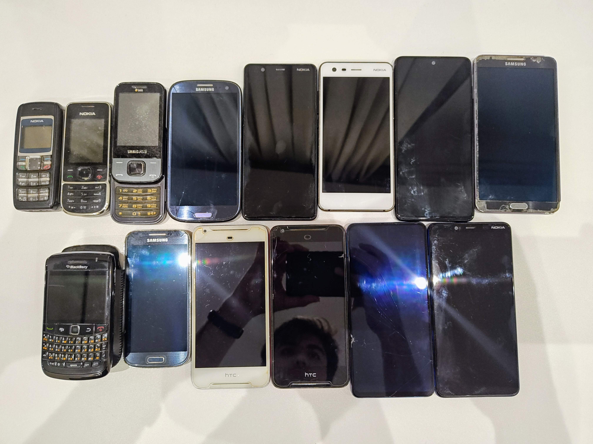

My first phone was a
[Samsung Galaxy Gio](https://www.gsmarena.com/samsung_galaxy_gio_s5660-3741.php).
My dad got it for me in 2011. It was "practically free"; the amount we paid got
loaded as credit to my SIM card. On this very phone, I learned to sideload apps
using APKs and do rooting.

A few years later I got my hands on a Samsung Galaxy Note 3, and I fell in love
immediately. Even though it was a gift to my dad, I quickly "took over." This
phone with its big screen and stylus was perfect for tinkering. And, dear
reader, did I tinker with it. Everything from custom and self-compiled ROMs to
modding the hardware. I played with it for 6-7 years while carrying it as my
daily driver. Many times I thought I'd bricked it, but some XDA thread always
came to the rescue. I owe a lot to that phone and everything it has taught me,
as well as the Android hacking community.

My family of eight back then naturally accumulated a lot of phones over the
years. I also got bunch of phones as prizes thanks to
[school competitions](/notebook/school-competitions/). Most of them were budget
Android phones, but I was able to get them working pretty well with ligher
custom ROMs. My Note 3 still runs well on LineageOS today! I have the freedom of
doing whatever I want with my older phones. One runs as a digital clock, one as
a DNS server, and one is running as my doorbell camera.

**But that freedom is disappearing.**

Google recently announced mandatory developer registration for all apps, even
sideloaded ones, starting September 2026. Samsung removed bootloader unlocking
globally with One UI 8 (July 2025). Xiaomi has an approval process that leaves
users waiting indefinitely. Banking apps now refuse to work on rooted devices or
custom ROMs you own.

What I could do on a budget phone in 2011 is becoming impossible on flagship
devices today. An entire generation of tinkerers, developers, and students won't
get the education I got because manufacturers are pulling up the ladder behind
them.

Think what'll happen in 10 years when the current phones become old. We'll have
to simply discard them because we can't make meaningful use of them anymore.
[Post-collapse computing](https://blogs.gnome.org/tbernard/2022/08/24/post-collapse-computing-1/)
is already happening, and this trend will only accelerate it.

I know some clever people out there will find ways to bypass these restrictions.
But when I was 8 years old, rooting my Galaxy Gio wasn't about being clever. It
was about being _accessible_ and _open_. Today I rarely find people who even
know what rooting is -- most peers I had in 2013 have had at least heard of
rooting. And it's not the current generation's fault. There's a huge gate in
front of them, and it's getting taller every year.

And we are being told a lot of lies, mostly "privacy" and "security" concerns. I
learned about Android's permissions system because I could see it. Custom ROMs
showed me what apps were doing behind the scenes. I installed privacy-focused
alternatives, removed bloatware, blocked trackers. I learned to care about
privacy because I had the tools to do something about it. If having an open
model of security and privacy was a concern, we'd be deep, deep in trouble by
now.

The people who need privacy tools the most -- students, activists, journalists,
people in restrictive countries -- are the ones who suffer when tinkering
becomes impossible. And we all know by this point that trusting your data to big
tech never really ends well, no matter if it's Apple, Google, or Microsoft.

To end this writing on a more positive note, I do strongly believe there's a
hope left and very smart folks working on this problem. We should support them
and help as much as possible.

> Please read and sign the [Keep Android Open](https://keepandroidopen.org/)
> petition so the same joys of having an open platform remain for future
> generations.

Here is an incomplete list of old phones that I still have and are still working
today. Not all of them are Android but all of them are hackable and usable in
some way.

My old friend Galaxy Note 3 is on the top right.
