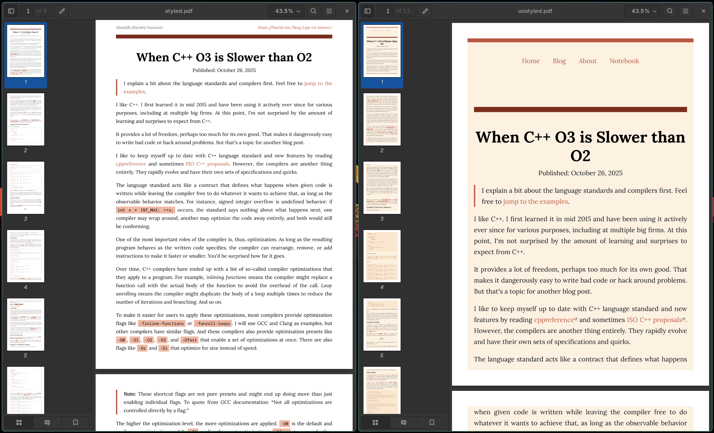
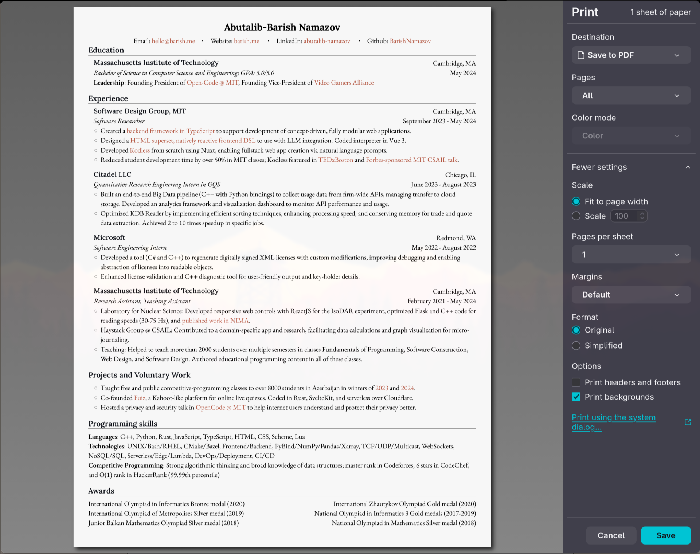

Until I took an
[experimental web design class at MIT](https://designftw.mit.edu) in early 2022,
I -- as it turns out -- knew nothing about web design. Being able to code
frontend isn't everything; I was taught about web standards, design principles,
color theory, typography, properly using modern CSS and JavaScript,
accessibility, and so on. It ended up being one of the most eye-opening classes
I took at MIT, largely because one of the instructors was
[Lea Verou](https://lea.verou.me/), a pioneer in the world of web standards. I
liked the class a lot so I decided to help teach the next iteration.

One of the cool things I learned was about styling the printable version of a
web page. Apparently, CSS
[media queries have a `print` type](https://developer.mozilla.org/en-US/docs/Web/CSS/Guides/Media_queries/Printing)
that are designed specifically for this. It supports any CSS, including the new
and shiny
[`@page` at-rule](https://developer.mozilla.org/en-US/docs/Web/CSS/Reference/At-rules/@page),
which lets you control page margins, numbering, and size; just like a complex
text processor like LaTeX or Typst. Best of all, it requires surprisingly little
code to make something ready to print. Here is an example that'll instantly make
a lot of websites printer-friendly:

```css
@media print {
  html {
    /* using !important in print mode is acceptable */
    background: white !important;
  }

  body {
    color: black !important;
  }

  body > header,
  nav,
  footer {
    display: none !important;
  }

  img,
  p:has(img) {
    break-inside: avoid; /* images won't break through pages */
  }
}
```

You can find the specific styles I use in
[my website CSS file](https://github.com/BarishNamazov/barish.me/blob/main/src/styles/global.css).

There is also a really cool trick to expand links for a paper printout version:

```css
/* Only expand links that start with http (external) */
a[href^="http"]::after {
  content: " (" attr(href) ")";
  /* ... maybe make small, or handle overflow, etc ... */
}

/* Exclude your own domain so we don't have relative links */
a[href^="https://barish.me"]::after
{
  content: none;
}
```

**Why is this exciting, you might ask?**

First, I prefer writing in Markdown over a heavy text processor. Printing this
way allows me to instantly convert my writings into a polished looking document
with my personalized styles. The alternatives -- e.g., generating an unstyled
PDF using Obsidian -- feel a bit lacking.

Try printing this page right now (Ctrl+P). You'll notice that unnecessary
content (like the nav bar) is gone, while my name and the link to this post have
been added to the header. I also removed the background color so we save ink on
actual printing. The difference is clear when you compare it with the unstyled
version:



Second, doing layouts with LaTeX or Typst is tricky. I still don't know how to
properly move an image around with LaTeX. But with modern CSS, it's much
simpler; I throw everything into a grid or a flexbox.

Take a look into my [outdated resume page](/resume/2024). It's implemented in
HTML and CSS. Thanks to some minimal media print queries and `@page` styling, it
prints perfectly onto a single page.

```css
@page {
  size: letter;
  margin: 0mm; /* remove default browser-added margins */
}
```



Modern web standards and browsers are powerful tools. By treating print as a
first-class citizen in your CSS, you gain the power of a typesetting engine
without ever leaving your text editor.

The best example of this is actually comes from the person who taught it to me:
Lea wrote her [PhD thesis](https://phd.verou.me/) with web technologies and made
it printable, and it indeed does look very pretty.
