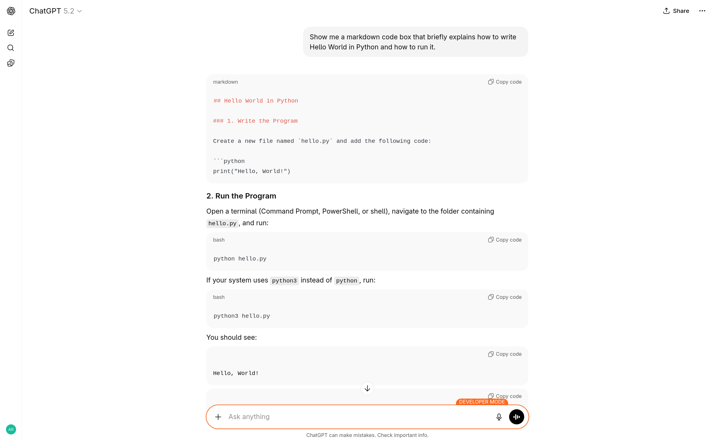
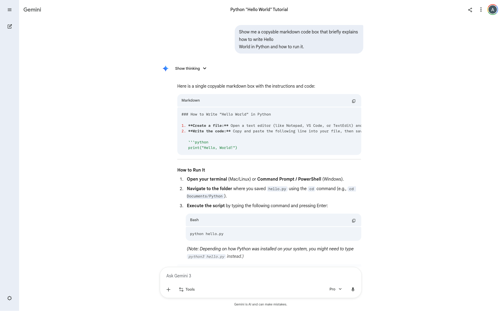
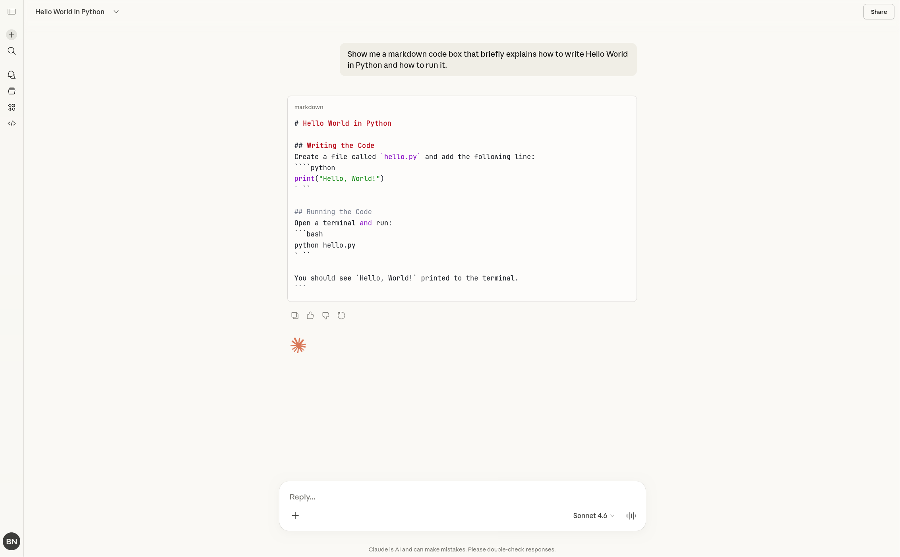
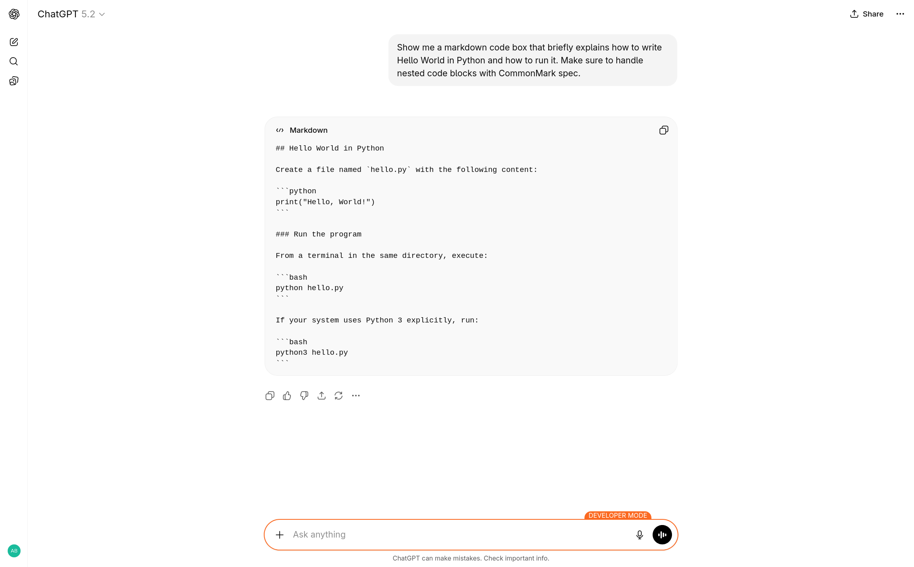
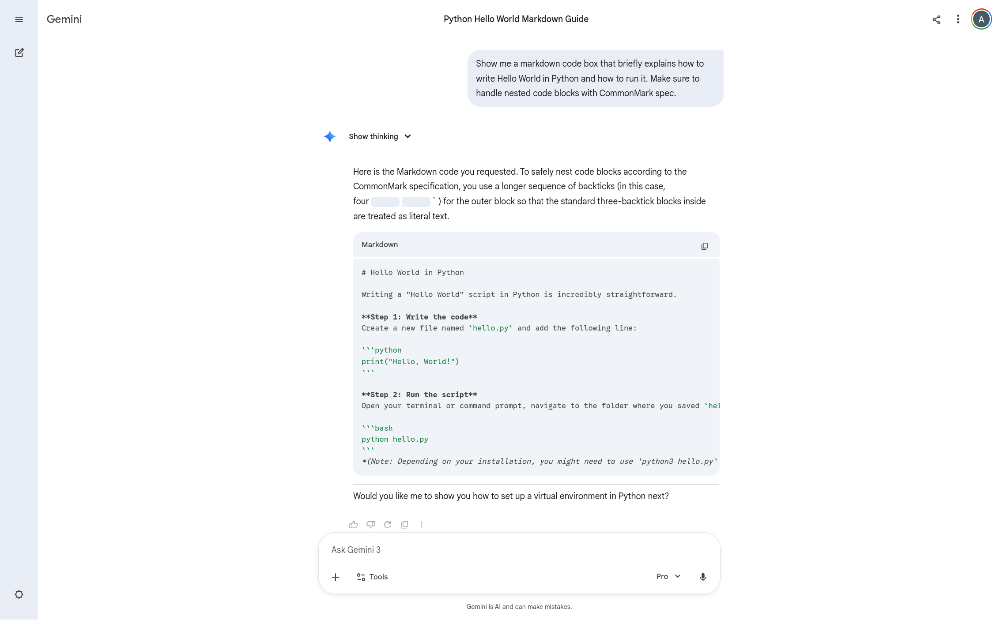
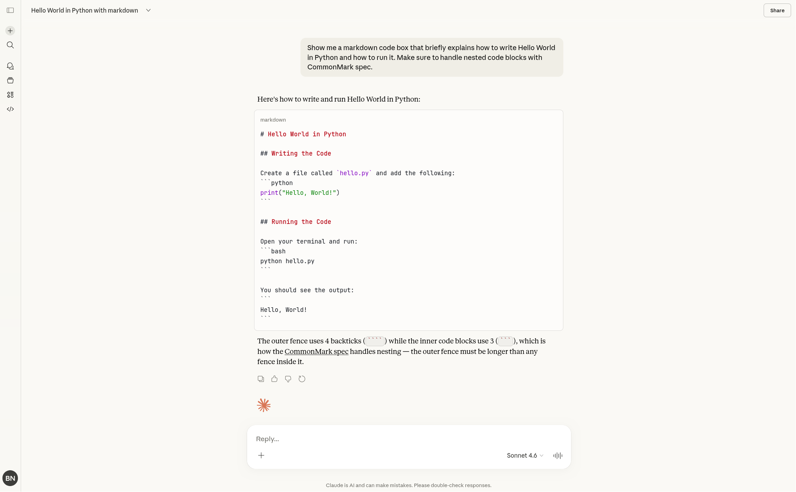

It's 2026; AI is booming. Singularity might happen on a
[Tuesday](https://campedersen.com/singularity) soon. But AI chatbots still can't
properly render code snippets along with text in any code-like format (Markdown,
LaTeX, Typst etc.).

Let's ask each chatbot a simple question:

> Show me a copyable markdown code box that briefly explains how to write Hello
> World in Python and how to run it.

## ChatGPT



## Gemini



"single copyable markdown codebox," right Google?

## Claude



Now, before you think Claude gave me the correct answer, look closely. This is
the output:

`````markdown
# Hello World in Python

## Writing the Code

Create a file called `hello.py` and add the following line:

````python
print("Hello, World!")
` ``

## Running the Code
Open a terminal and run:
```bash
python hello.py
` ``

You should see `Hello, World!` printed to the terminal.
```
````
`````

What are these 4 backticks or the extra spaces between backticks? Before it
renders, you actually see ChatGPT- or Gemini-like formats, then it turns into
this monstrousity.

## How to Fix This?

The CommonMark spec allows you to define nested code blocks by using more
backticks for the outer block. So this is, in some way, the model producing bad
markdown. But the solution, as solutions always are, is just prompting the model to use correct markdown formatting:

> Show me a markdown code box that briefly explains how to write Hello World in
> Python and how to run it. Make sure to handle nested code blocks with
> CommonMark spec.

Now we see much nicer results (click to zoom):

<style>
.fixed-collage {
  display: grid;
  grid-template-columns: repeat(2, 1fr);
  gap: 8px;
  margin-top: 1rem;
}
.fixed-collage p {
  display: contents;
}
.fixed-collage img {
  width: 100%;
  object-fit: contain;
}
</style>

<div class="fixed-collage">





</div>

This should simply be added to the system prompt, and all of us can have a
happier life with copiable code snippets.
